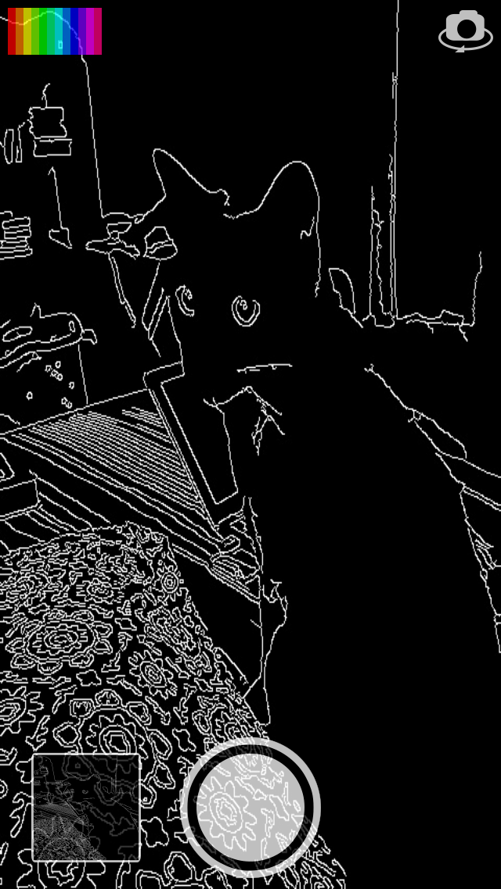
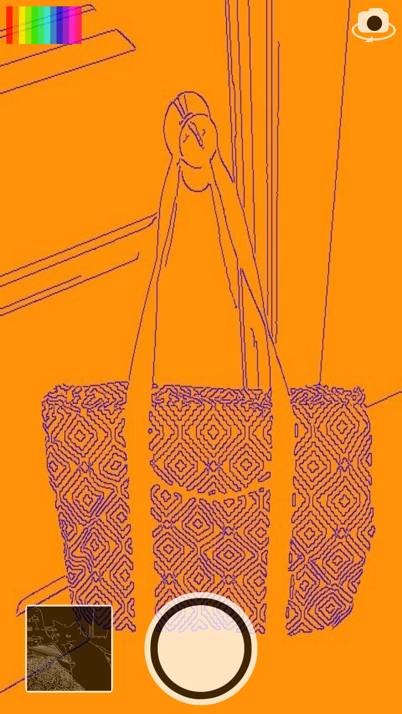
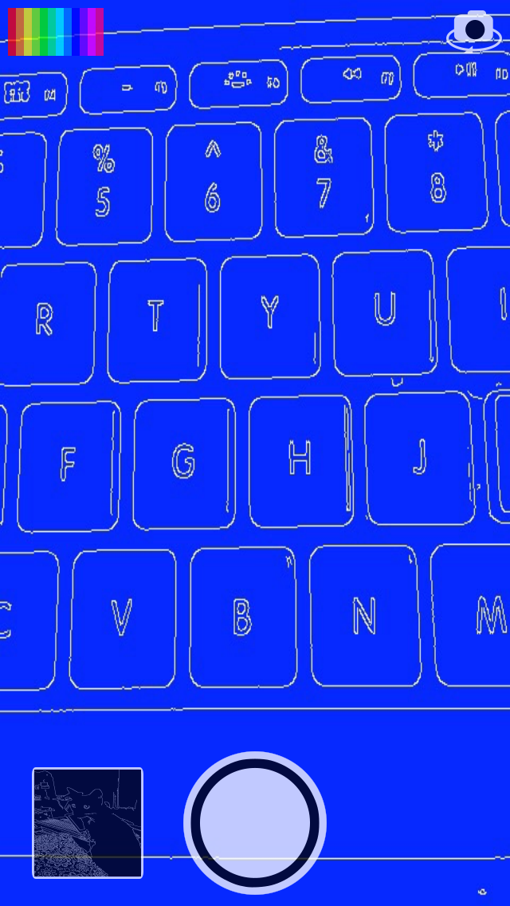
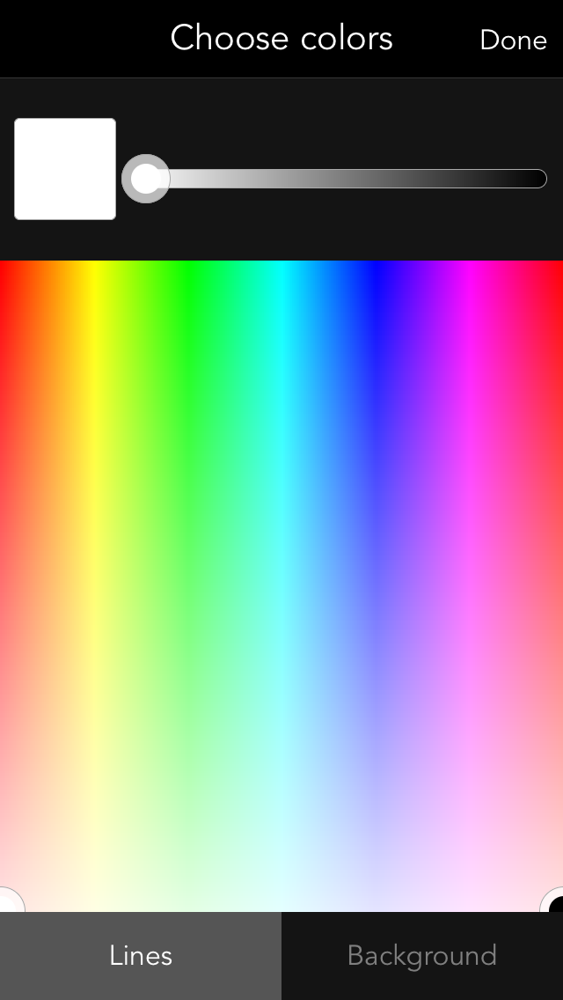

# Bent Lens
Bored? Try Bent Lens.

Explore the world through a contour lens. Bent Lens is an app that turns what your camera sees into outlines. Capture fun new photos and share them from within the app. Customize the lines and background colors.






Get Bent Lens on the [App Store](https://itunes.apple.com/us/app/bent-lens/id1090747884?mt=8)

## Build
(1) Install [CocoaPods](http://cocoapods.org):
```
gem install cocoapods
```
(2) Clone repository: 
```
git clone https://github.com/stackhall/bentlens.git
```
(3) Install pods:
```
cd bentlens
pod install
```
(4) Open workspace in XCode:
```
open BentLens.xcworkspace
```
(5) Build the BentLens scheme

## Pull Requests
Pull requests are welcome! Follow these guidelines:

1. The [Apple Coding standards](https://developer.apple.com/library/content/documentation/Cocoa/Conceptual/CodingGuidelines/CodingGuidelines.html)
2. Remove space between class name and * when defining reference objects
3. Remove space between if/else statements and the opening '('

## License
Author: Rehan Shariff (rehan.shariff@stackhall.com), Stackhall Learning Services, LLC.

Some portions of this code is copyrighted by other authors (Michael Waterfall, Ryota Hayashi, Eduard Feicho, and Alexander Shishkov). Their code is licensed under the MIT or Apache licenses. All such files have the original copyright notice.

The code for Bent Lens is available under the MIT license. See the [LICENSE](./LICENSE) file for more info.

## EULA
The EULA for Bent Lens is avaialable [here](./EULA.txt).

## Images
All images are copyright © 2016 Stackhall Learning Services, LLC. All rights reserved.
